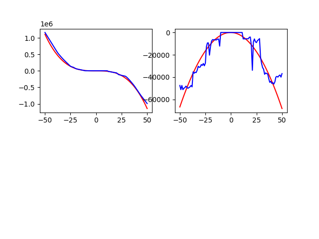

# 파이썬 딥러닝을 활용해 함수의 값, 미분계수, 정적분 값 예측하기

수학2 주제탐구

## 1. 연구 목적

우리가 임의의 함수를 정하고, 딥러닝 인공지능에게 주어진 몇 개의 x좌표에 대한 함숫값 데이터만을 훈련 시켰을 때, 인공지능은 함수 전체를 예측해낼 수 있을까?
함수를 예측해냈다면, 그것에서 얻어낸 미분계수나 정적분 값 또한 같게 나올까?

## 2. 연구 동기

지난 주제탐구 시간에 탐구한 선형 회귀는 직선 형태의 선형 데이터에서만 사용이 가능하다.
이번엔 딥러닝을 이용해 모든 형태의 데이터에서 회귀를 해보고싶었다.
무작위로 주어진 고차 다항함수를 예측하는 회귀 모델을 파이썬 프로그래밍 언어로 만들어보며 딥러닝에 대해 탐구하고 싶어 주제를 정하였다.

## 3. 연구내용

### (1) 필요한 라이브러리 불러오기

```python
import matplotlib.pyplot as plt
import numpy as np
from tensorflow import keras
from tensorflow.keras import layers
from tensorflow.keras import optimizers
import random
```

연구에 필요한 라이브러리들을 import 해준다.
우선 tensorflow와 tensorflow.keras는 딥러닝 신경망 모델을 만드는 데 사용되는 라이브러리다.
그리고 numpy는 데이터 어레이를 만들 때 사용된다.
마지막으로 matplotlib는 데이터 시각화 라이브러리로 그래프를 그릴 때 사용된다.

### (2) 무작위 함수식 만들기

```python
# 3차부터 5차까지의 차수 정하기
dimension = random.randint(3, 5)

# 계수 리스트(상수항부터 고차항으로 올라감)
factor_list = []

# 차수+1개의 계수 필요
for i in range(dimension + 1):

# 계수 리스트에 -10부터 10까지의 정수 추가하기
factor_list.append(random.randint(-10, 10))


# f(x) 지정(인공지능에게는 함숫값만 주어짐)
def f(x):
	result_value = 0
	for current_dim in range(dimension + 1):
		# result_value에, (각 항의 계수) * (x값^current_dim) 을 더함
		result_value += factor_list[current_dim] * (x**current_dim)
		return result_value

# f'(x)
def der_f(x):
	result_value = 0
	# 한 차수 작음
	for current_dim in range(dimension):
		# 계수 = (current+1차항 계수) * (current+1) * (x값^current_dim)
		result_value += factor_list[current_dim + 1] * (current_dim + 1) * (x**current_dim)
	return result_value
```

예측할 다항함수를 무작위로 만들어주는 과정이다.
그리고 그 함수는 인공지능에게 주어지지 않는다.
우선 함수의 차수(dimension)을 정했다.
다항함수에서 항은 상수항을 포함해 차수+1개까지 있을 수 있기에, 계수 리스트(factor_list)에 무작위 정수를 차수+1개 넣어주었다.
다항식 미분의 원리를 적용하여, 도함수 f'(x)를 구현해주었다.

### (3) 학습 데이터 생성

```python
# 학습 데이터 만들기
train_x_data = []
train_y_data = []
for i in range(50):
	# -50부터 50 사이의 x값에 대한 데이터 50개
	random_int = random.randint(-50, 50)
	train_x_data.append(random_int)
	train_y_data.append(f(random_int))
train_x_data = np.array(train_x_data)
train_y_data = np.array(train_y_data)
```

인공지능에게 주어질 학습 데이터를 만든다.
무작위 x좌표에 대한 함숫값이 신경망에게 주어지는 것이다.
x값은 -50부터 50까지이고, 데이터는 50개가 만들어진다.
데이터 생성이 끝난 후 사용되는 np.array 구문은, 기존 파이썬 리스트를 더 효율적인 numpy 어레이로 변환하는 함수이다.

### (4) 신경망 구조 설계 & 학습

```python
# 모델 생성, 층 설정
model = keras.Sequential()
model.add(layers.Dense(12, input_dim=1, activation="relu"))
model.add(layers.Dense(128, activation="relu"))
model.add(layers.Dense(128, activation="relu"))
model.add(layers.Dense(128, activation="relu"))
model.add(layers.Dense(1))

adam = optimizers.Adam(learning_rate=0.01)
model.compile(loss="mse", optimizer=adam)

# 모델 학습시키고 history 에 저장
history = model.fit(train_x_data, train_y_data, epochs=100, batch_size=1, shuffle=False, verbose=1)
```

keras에서 Sequential 메서드를 불러와 model에 저장시켜주었다.
이때 model은 신경망의 틀이 된다.
그리고 model에 여러개의 층을 추가시켜주었다.
모델을 생성할 때, 입력층은 데이터에 따라 자동으로 하나가 생성되게 된다.
지금 사용하는 데이터는 정의역의 변수가 1개이므로, 입력층의 뉴런도 1개가 자동 생성된다.
따라서 만들어지는 신경망은 1-12-128-128-128-1 모양이 된다.

그리고 학습 전, optimizer가 필요하다.
optimizer란 신경망의 학습을 위한 수학적 알고리즘인데,
저번에 탐구했던 경사하강법 또한 optimizer에 속한다.
이번엔 Adam이라는 optimizer를 사용했다.
그리고 fit 메서드로 앞서 만든 학습 데이터들을 학습시켰다.
100번 학습시키고 저장했다.

### (5) 함수 예측해보기

```python
# 학습된 모델로 함수 예측하기
x_data = []
y_data = []
predict_y_data = []
# 반복문으로 -50부터 50까지 예측
for i in range(-50, 51):
	x_data.append(i)
	y_data.append(f(i))
	predict_y_data.append(float(model.predict([i])))
x_data = np.array(x_data)
y_data = np.array(y_data)
predict_y_data = np.array(predict_y_data)
```

-50~50의 x값에 대한 함숫값을 예측해보았다.
y_data는 실제 값, predict_y_data는 예측 값을 담은 배열이다.
이때 예측값이 float형태가 아닌 다른 자료형으로 나타나 결과값에 float를 적용해야 했다.
학습 데이터를 만들 때와 동일하게 numpy 배열로 만들어주었다.

### (6) 예측한 함수의 도함수 정의

```python
# 예측한 모델의 도함수 만들기
def predict_der_f(x):
	# 극한 대신 0에 가까운 값(0.0001) 사용
	delta_x = 1e-4
	# 도함수의 정의 사용 ( lim:h->0 에서 (f(x+h)-f(x))/h )
	return float(model.predict([x + delta_x]) - model.predict([x])) / delta_x
```

도함수를 구하기 위해서는 극한이 필요한데, 라이브러리 없이는 파이썬이 극한을 지원하지 않았다.
따라서 0에 아주 가까운 1e-4(0.0001)을 x의 변화량(h)로 두고 미분계수의 정의를 활용해 도함수를 만들어주었다.

### (7) 도함수 예측 해보기

```python
# 실제 도함수와 예측된 도함수 비교
der_x_data = []
der_y_data = []
predict_der_y_data = []
# -50부터 50까지 예측
for i in range(-50, 51):
	der_x_data.append(i)
	der_y_data.append(der_f(i))
	predict_der_y_data.append(predict_der_f(i))
der_x_data = np.array(der_x_data)
der_y_data = np.array(der_y_data)
predict_der_y_data = np.array(predict_der_y_data)
```

5번 단계와 같은 방식으로, -50~50까지의 x값에 대한 미분계수를 예측해보았다.
그리고 이것을 각각의 numpy 배열에 담았다.

### (8) 시각화하기

```python
# 함수 그래프
plt.subplot(221)
plt.plot(x_data, y_data, color="red")
plt.plot(x_data, predict_y_data, color="blue")

# 도함수 그래프
plt.subplot(222)
plt.plot(der_x_data, der_y_data, color="red")
plt.plot(der_x_data, predict_der_y_data, color="blue")

# png로 저장
plt.savefig("results.png")
```

matplotlib를 활용해 그래프를 그린다.
첫 번째는 실제 함수를 빨간색으로, 예측한 함수를 파란색으로 나타내는 그래프를 그린다.
두 번째는 실제 도함수를 빨간색으로, 예측한 도함수를 파란색으로 나타내는 그래프를 그린다.

### (9) 시각화 결과 보기



코드를 실행시키자 이렇게 함수, 도함수의 그래프가 제대로 생성되었다.
함수 그래프의 경우 거의 완전 일치하는 것을 볼 수 있다.
그러나 도함수의 경우, 예측한 도함수의 모습이 부드럽지 않고 끊겨있는 것을 볼 수 있는데,
확실하진 않지만, 이는 도함수의 정의에서 실제로 극한을 사용하지 않았기 때문이라고 생각된다.
하지만 근삿값으로는 갑자기 값이 튀는 현상을 설명하기 어려워 다른 문제가 있는 것 같기에, 이후 원인을 더 찾아보고자 한다.

## 4. 결론 및 느낀 점

파이썬 딥러닝을 이용해 성공적으로 함수와 도함수를 예측하는 인공지능 신경망 모델을 만들었다.
아쉽게도 예측한 함수를 적분하는 방법을 찾지 못해, 정적분값은 비교하지 못했다.
다음 탐구를 진행할 때는 구분구적법에 대해 탐구하여 딥러닝을 통해 정적분의 값 또한 예측해 보고 싶다.

## 5. 참고문헌

구글 텐서플로우 라이브러리 공식문서 (https://www.tensorflow.org/guide)
